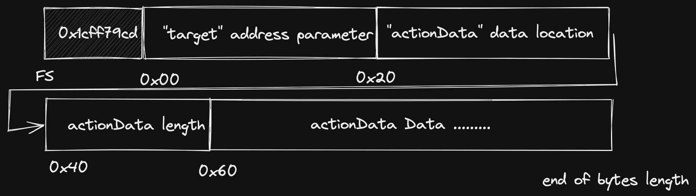

+++ 
draft = false
date = 2023-03-13T18:18:37+11:00
title = "ABI Smuggling - DamnVulnerableDeFi v3 #15"
description = "Writeup for ABI Smuggling"
slug = ""
authors = []
tags = ["dvdf", "writeup", "defi", "abi smuggling"]
categories = []
externalLink = ""
series = []
toc = true
+++

## Overview

In this challenge we are provided with a single challenge contract which
requires us to extract all funds from the contract. It has an Authorization
mechanism which is in `AuthorizedExecutor.sol` that only allows certain
addresses perform certain actions through permission based authorization. In the
setup of the challenge the deployer is setup to be able to call the
`sweepFunds()` with signature **0x85fb709d**, and the player is able to call the
`withdraw()` function which has a signature of **0xd9caed12**.

Working backwards from the `sweepFunds()` function it has a modifier of
`onlyThis` which will only allow the challenge contract itself to call this
function. Meaning this will need to come from the execute() function which is
limited by the permissions that are configured in the setup of the challenge.

## The execute() function

To begin let's take a closer look at how the execute function works. It takes 2
parameters, that being an address of the target you want to execute on (which
because of the _beforeFunctionCall() requires this to be the contract itself)
and the `actionData` for the call which is the calldata you want to call that
address with.

As permissions are enforced by hashing just the (sender, target,
functionSelector) the content of the `actionData` can be anything as long as we
are calling the right function on the right contract. However the player's
permissions are limited to the `withdraw()` function which does not have any
parameters we can play with. So let's take a closer look on how the function
retrieves these values from the `actionData`.

The sender and the target are already provided from the function call, so there
isn't much we can do to change this, however there is this interesting bit of
code which retrieves the function selector from the `actionData`.

```sol
bytes4 selector;
uint256 calldataOffset = 4 + 32 * 3; // calldata position where `actionData` begins
assembly {
    selector := calldataload(calldataOffset)
}
```

So this is reading 4 bytes into the `selector` variable with an offset of (4 +
32 * 3) bytes from the calldata. The calldata is the data that was called with
the function (this is different from the actionData which itself is calldata but
for the function that we want to execute. However confusingly, the `actionData`
is contained within the calldata). So why are we reading the selector from this
seemingly magical offset?

This is where a bit of ABI encoding knowledge will come in handy. This code is
reading the calldata which was called with the `execute()` function call. The
calldata will look something like this



The function selector will be located at the start of the `actionData`
parameter's data. So where is this located in the calldata? The key thing to
know here is that dynamically sized parameters are stored differently from known
sized parameters. So in the `execute()` function there are two parameters of
type `address` and `bytes`. Since ethereum addresses are 20 bytes long, this can
be stored directly and without a reference, however since the `bytes` parameter
can be any size we need to store a reference to the start of the data. To read
more about this please read about the [ABI spec here in the solidity
docs](https://docs.soliditylang.org/en/v0.8.19/abi-spec.html).

So in the calldata layout shown in the diagram above the start of the
`actionData` actual data is at byte 0x04 + 0x60. Which is 4 bytes for the
function selector, 32 bytes for the first `address` parameter, 32 bytes for the
`actionData` parameter location, 32 bytes the `actionData` parameter length,
then finally the actual `actionData` parameter data! And of course the first 4
bytes of the `actionData` data is the function selector of the function we are
trying to call! So hence the offset of 4 + 32 * 3.

## Theory crafting an exploit

So looking at the next part of the code, we need to have permission to call the
function we are wanting to call in our `actionData`

```sol
if (!permissions[getActionId(selector, msg.sender, target)]) {
    revert NotAllowed();
}
```

If we can set the `actionData` function selector to the `sweepFunds()` function
selector and pass this check then we should be able to solve the challenge. So
how can we do that?

Well we are fully in control of the calldata that we send to the contract and in
any normal ABI encoding the `actionData` data will start at the (4 + 32 * 3 )
byte offset. But what if it wasn't? Does it have to be? Can we change that?

*NOTE: From now on I will be refering offsets ignoring the 4 bytes at the start
for the function selector.*

Thinking back now to how dynamic variables are stored in ABI encoded calldata,
the 32 bytes starting at 0x20 stores a *reference* to the start of the
`actionData` data. In normal ABI encoding this will be 0x40. But what if we
manually changed that to say 0x60 or 0x80, or any multiple of 0x20? Then we
could pad the data in between and put the actual data further down in the
calldata?


An indeed this is actually valid calldata... well kind of! Solidity does not
check whether the calldata is too big for the function it is trying to call, it
can't (note it can check however if the calldata is too small). But there is
still two problems we need to solve. Now the selector that the smart contract
will read will be 0x00000000 since it will read the first 4 bytes of the
`actionData` length, but if we change that, then we are changing the length of
the `actionData` bytes which will result in a bad parameter call.

So let's shift the `actionData` over again another 32 bytes so our reference
will point to 0x80 as the start, but this time the first four bytes starting at
0x60 we can set to the function selector of `withdraw()` (since this is the
function our address is allowed to call) and it won't affect the length of the
`actionData` bytes. So now we will have something that looks like this:


So now when the contract reads the 4 bytes starting at (4 + 32 * 3) it will read
the selector that we have planted but when the contract actually executes the
`actionData`, it will use whatever selector is in our `actionData`! Sweet, we
are ready to code the exploit.

*NOTE: There is another requirement in the `_beforeFunctionCall()` function that
the target address must be the contract itself, this is fine since we are
targeting the contract anyway, so we don't need to worry about that.*

## Implementing the exploit

Since the standard libraries for ethereum will always ABI encode the calldata
correctly we cannot utilise libraries here and we will need to encode our
calldata manually. I think the easiest way to follow here is to look at the code
directly:

```javascript
// Connect to challenge contracts
const attackVault = await vault.connect(player);
const attackToken = await token.connect(player);

// Create components of calldata

const executeFs = vault.interface.getSighash("execute")
const target = ethers.utils.hexZeroPad(attackVault.address, 32).slice(2);
// Modified offset to be 4 * 32 bytes from after the function selector
const bytesLocation = ethers.utils.hexZeroPad("0x80", 32).slice(2); 
const withdrawSelector =  vault.interface.getSighash("withdraw").slice(2);
// Length of actionData calldata FS(1 * 4) + Parameters(2 * 32) Bytes
const bytesLength = ethers.utils.hexZeroPad("0x44", 32).slice(2)
// actionData actual data: FS + address + address
const sweepSelector = vault.interface.getSighash("sweepFunds").slice(2);
const sweepFundsData = ethers.utils.hexZeroPad(recovery.address, 32).slice(2)
              + ethers.utils.hexZeroPad(attackToken.address, 32).slice(2) 

const payload = executeFs + 
                target + 
                bytesLocation + 
                ethers.utils.hexZeroPad("0x0", 32).slice(2) +
                withdrawSelector + ethers.utils.hexZeroPad("0x0", 28).slice(2) +
                bytesLength + 
                sweepSelector + 
                sweepFundsData;
```

Here we construct the exact layout of the calldata we created in the diagram
above. Since we are actually calling the `sweepFunds()` function, this function
takes two parameters both of type `address` so we know that the length of the
`actionData` will be 4 + (2 * 32) bytes (function selector + 2 parameters).

Then we can simply send this transaction to the contract with this payload as
the data component of the transaction and boom we solved the challenge!

```javascript
await player.sendTransaction(
    {
        to: attackVault.address,
        data: payload,
    }
)
```