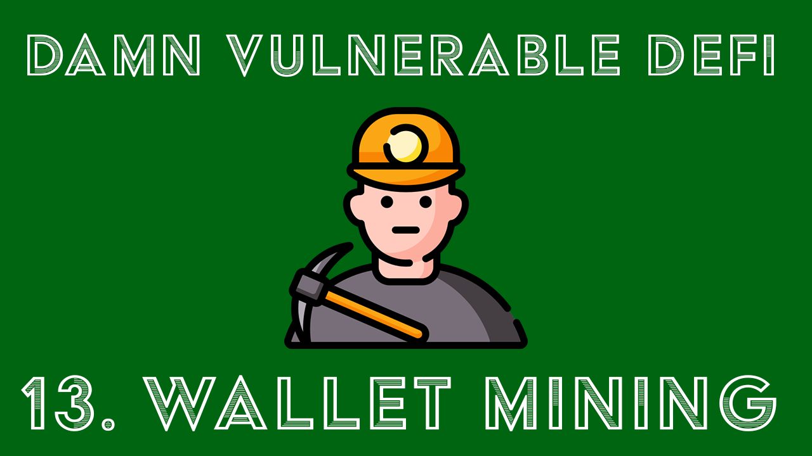

+++ 
draft = false
date = 2023-03-01T12:50:25+11:00
title = "Wallet Mining - DamnVulnerableDeFi v3 #13"
description = "Writeup for the Wallet Mining Challenge"
slug = ""
authors = []
tags = ["defi", "DamnVulnerableDeFi", "wallet mining", "writeup"]
categories = []
externalLink = ""
series = []
+++
[](https://www.youtube.com/watch?v=7PS-wuIsZ4A)

# Writeup

This challenge consists of two main exploits to solve the challenge.
1. Replaying the deploying of Gnosis Safes Master Copy and factory to get code
   deployed at the predefined addreses
2. Bricking the implementation AuthorizerUpgradeable contract to pass the checks
   in the WalletDeployer contract

The full coded solution for this challenge is available on [my
GitHub](https://github.com/BlueAlder/damn-vulnerable-defi/blob/master/test/wallet-mining/wallet-mining.challenge.js).

[My YouTube walkthrough is also
available.](https://www.youtube.com/watch?v=7PS-wuIsZ4A)


## Part 1: Getting that 20 million DVT

To get the 20 million tokens located at the deposit address we first need to
deploy the factory and mastery copy of the Gnosis Safe. If we look up the
relevant addresses on
[etherscan](https://etherscan.io/address/0x34cfac646f301356faa8b21e94227e3583fe3f5f#code),
we can see that these are the addreses of the 1.1.1 version of gnosis safe and
factory.

Looking at the [transaction
history](https://etherscan.io/address/0x1aa7451dd11b8cb16ac089ed7fe05efa00100a6a)
of that deploying wallet. We see that we can replay this exact transaction using
the [raw transaction
hex](https://etherscan.io/getRawTx?tx=0x06d2fa464546e99d2147e1fc997ddb624cec9c8c5e25a050cc381ee8a384eed3)
since this is already a signed transaction from the deploying wallet and nonce
but on the hardhat eth chain. Since CREATE (as oppposed to CREATE2) contracts
are a function of (msg.sender, nonce) we can create it at the exact same address
but on our network. 

We can do this for the proxy factory as well since that is the third tx that is
made by the same wallet. But we will need to send the 2nd tx aswell to increase
the nonce for that wallet. Note that we need to fund the deploying address
before doing any of these transactions.

```javascript
// Fund deployer address
const tx = {
    to: data.REPLAY_DEPLOY_ADDRESS,
    value: ethers.utils.parseEther("1")
}
await player.sendTransaction(tx);

// Replay safe deploy transaction with same data from mainnet
// Contract address will equal 0x34CfAC646f301356fAa8B21e94227e3583Fe3F5F
// https://etherscan.io/tx/0x06d2fa464546e99d2147e1fc997ddb624cec9c8c5e25a050cc381ee8a384eed3
//  Nonce 0
const deploySafeTx = await (await ethers.provider.sendTransaction(data.DEPLOY_SAFE_TX)).wait();
const safeContractAddr = deploySafeTx.contractAddress;
log("Replayed deploy Master Safe Copy at", safeContractAddr);

// Do same thing but with nonce 1
const randomTx = await (await ethers.provider.sendTransaction(data.RANDOM_TX)).wait();

// Replay factory deploy transaction with same data from mainnet
// Contract address will equal 0x76E2cFc1F5Fa8F6a5b3fC4c8F4788F0116861F9B 
// https://etherscan.io/tx/0x75a42f240d229518979199f56cd7c82e4fc1f1a20ad9a4864c635354b4a34261
// Nonce 2
const deployFactoryTx = await (await ethers.provider.sendTransaction(data.DEPLOY_FACTORY_TX)).wait();
const factoryContractAddr = deployFactoryTx.contractAddress;
log("Replayed deploy safe factory at", factoryContractAddr);
```

Then to get access to the **DEPOSIT_ADDRESS** we have to guess a little bit.
Taking into account the name of the challenge *Wallet Mining* and now that we
have the Proxy Factory at a specified address that can create new contracts, we
can postulate that the address will be one of the proxies created by this
address at a specified nonce. 

```javascript
let nonceRequired = 0
let address = ""
while (address.toLowerCase() != DEPOSIT_ADDRESS.toLowerCase()) {
   address = ethers.utils.getContractAddress({
         from: factoryContractAddr,
         nonce: nonceRequired
   });
   nonceRequired += 1;
}
console.log(`Need to deploy ${nonceRequired} proxies to get access to 20mil`);
```

And whatdaya know exactly 44 proxies to get the DEPOSIT_ADDRESS (note that this
means the tx we are after is one with nonce=43, since tx=1; nonce=0).

Since we have complete ownership of this Gnosis Safe Proxy at this address, we
can then simply run an `execTransaction` on the Gnosis Wallet to transfer all
the tokens to the player address and get the 20 million.

I wont go into detail on how that is done, but in a nutshell you sign the
transaction hash generated by the Gnosis Safe. If you use the eth_sign method,
you need to increase the `v` value by 4 and then run `execTransaction`. Check
out [the
code](https://github.com/BlueAlder/damn-vulnerable-defi/blob/2b04ed65617c401032ae3388ce4d33aea224a435/test/wallet-mining/wallet-mining.challenge.js#L167)
to see how this is implemented.

# Part 2: Bricking the UUPS Proxy

To get the remaining 43 tokens we need to take a look at the contracts provided.
Working backwards we need to call the `drop()` function on the WalletDeployer
contract, which will deploy a proxy and if we are allowed (the can() function)
we will get 1 token transfered to us.

The can function in the WalletDeployer is in assembly to mess with us I believe.
But it is a fancy way of calling the can() function of the
AuthorizerUpgradeable.sol. We will come back to this.

So taking a look at the AuthorizerUpgradeable, the interesting part here is that
it is implemented as proxy UUPS contract. Since the contract is already
initialized the only function we can interact with is the can() function, which
is a `view` function which isn't exactly helpful to us. We also cannot call
upgradeToAndCall() since we are not the owner of the contract.

So why is this implemented as proxy? Well turns out there is a security issue
with UUPS contracts if you don't lock down the initializer function properly.
You can read the details of it
[here](https://forum.openzeppelin.com/t/uupsupgradeable-vulnerability-post-mortem/15680)
but essentially, if you don't lock down the initializer function to only be
called by proxies and not by the implementation contract, you can mess things up
real bad. 

So we can get the implementation contract address from the proxy, by reading the
slot storage at the specific address provided by
[EIP-1967](https://eips.ethereum.org/EIPS/eip-1967). Then we can interact with
that contract by calling the `initialize()` function of the **implementation
contract** meaning we take ownership of the implementation contract. 

```sol
function init(address[] memory _wards, address[] memory _aims) external initializer {
    __Ownable_init();
    __UUPSUpgradeable_init();

    for (uint256 i = 0; i < _wards.length;) {
        _rely(_wards[i], _aims[i]);
        unchecked {
            i++;
        }
    }
}
```

Right now this isn't that helpful, since all state is still located in the proxy
contract, and the proxy contract simply uses the implementation contract just
for it's logic. So we can only abuse this if we can mess with the logic of the
contract. But with contracts being immutable, thats not exactly a good sign.
However if you read through the rest of the vulnerbility post mortem above, it
mentions that if you run a `selfdestruct` on the contract you can delete the
contract from existance. 

We do this through the `upgradeToAndCall()` function on the implementation
contract since we are the owner of it! We  create a new contract ourselves with
a single function that calls selfdestruct. We also will need to implement a
PROXY_UUID to make it pass the UUPS upgradeable check. Then when we upgrade to
that contract, it will delegatecall selfdestruct and destory the contract. 

So how does this help us? This is where we come back to the assembly code in the
WalletDeployer.sol. Here is an overview of what each line is doing.

```sol
// Explanation of GAS code
// TODO(0xth3g450pt1m1z0r) put some comments
  function can(address u, address a) public view returns (bool) {
      assembly { 
          // Authorizer Upgrader proxy address (mom storage variable)
          let m := sload(0)
          // Ensure m has code
          if iszero(extcodesize(m)) {return(0, 0)}
          // load free memory address at 0x40 into p
          let p := mload(0x40)
          // store [p + 0x44] at 0x40 to update free memory pointer
          mstore(0x40,add(p,0x44))
          // store at p the sighash for the can() function in AuthorizeUpgrader
          mstore(p,shl(0xe0,0x4538c4eb))
          // store at p + 0x04 the imp address
          mstore(add(p,0x04),u)
          // store at p + 0x24 the aim address
          mstore(add(p,0x24),a)
          // Static call the function and check return is > 0
          if iszero(staticcall(gas(),m,p,0x44,p,0x20)) {return(0,0)}
          // Check return data size is NOT zero AND return data is 0 then return false 0
          if and(not(iszero(returndatasize())), iszero(mload(p))) {return(0,0)}
      }
      return true;
  }
```

The can() function has 3 main checks which will fail the
can() check and execution will cease.

```sol
if iszero(extcodesize(m)) {return(0, 0)}
   ...        
if iszero(staticcall(gas(),m,p,0x44,p,0x20)) {return(0,0)}
if and(not(iszero(returndatasize())), iszero(mload(p))) {return(0,0)}
```

Firstly, `m` (which is the address of the AuthorizerUpgradeable contract) must
be a contract with bytes > 0. But didn't we just selfdestruct meaning it is
zero? Nope, m is pointing to the proxy, not the implementation, so that will
still have data!

Secondly, when we staticcall the AuthorizerUpgradeable contract it should be
successful (not the result, just that the call was successful). Since when using
a low level call, function existance checks don't happen, nothing happens,
therefore the call is a success! 

Finally the return data size needs to be = 0 OR the return data must not be zero
(this is where is does the actual check of the result of the call). Since there
is no return data, we bypass this check as well!

This results in `true` being returned and we collect our tokens! We do this 43
times and we have solved the challenge

## Closing Notes

### Learning Points from this challenge

 - Cross chain replay attacks, and how to prevent them
 - Signing Gnosis Safe transactions
 - Uninitialized UUPS implementation contract vulns
 - That call* methods do not check function existance and return success if they
   don't exist

### Other Info

You can heavily optimise this exploit by reducing the number of transactions
required by firstly bricking the contact and then deploying the 43 proxies
through the deployer contract to gain acccess to the DEPOSIT_ACCOUNT. But I didn't do this since it is easier to follow this way :). 

This challenge was based off or similar to the [Optimisim 20 million token
hack](https://decrypt.co/102377/ethereum-layer-2-solution-optimism-loses-20-million-tokens-in-interlayer-snafu)
that happened not too long ago that suffered a similar issue.

Initially when solving this challenge, I fell down multiple rabbit holes.
Including how Gnosis uses CREATE2 to deploy contracts at the same address for
multiple chains using a [deterministic deployment
proxy](https://github.com/Arachnid/deterministic-deployment-proxy) to account
for EIP-155.